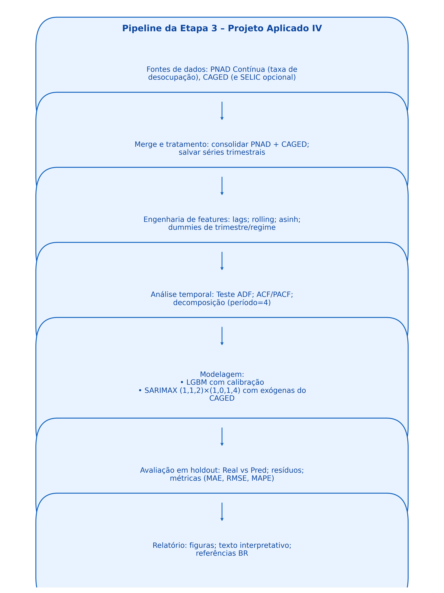

# PROJETO APLICADO IV - Ciência de Dados EaD - 2025/02

<p align="right">
  
</p>

# Previsão da Taxa de Desemprego no Brasil (2012–2025)

Este projeto tem como objetivo prever a **taxa de desocupação no Brasil** com base nos microdados do **Cadastro Geral de Empregados e Desempregados (CAGED)**, em conjunto com variáveis macroeconômicas como a **taxa SELIC** e indicadores da **PNAD Contínua (IBGE)**.  
O modelo é construído com técnicas de **séries temporais** (ARIMA, SARIMA, SARIMAX e regressão de gradiente), visando fornecer subsídios para **políticas públicas, análise socioeconômica e apoio à tomada de decisão**.

---

## Objetivo Geral
Desenvolver um **modelo preditivo** capaz de estimar a taxa de desocupação no Brasil para o período recente, integrando informações do **mercado formal (CAGED)** e **condições monetárias (SELIC)**, com apoio da **PNAD Contínua** para validação e comparação.

## Objetivos Específicos
- Consolidar e tratar uma base **2012–2025** com CAGED, PNAD e SELIC (frequência trimestral).  
- Incorporar variáveis exógenas e engenharia de atributos (lags, médias móveis, dummies sazonais e estruturais).  
- Verificar propriedades estatísticas da série (estacionariedade, sazonalidade, autocorrelações).  
- Testar modelos de previsão (**Naive, ARIMA, SARIMA, SARIMAX, LGBM Regressor**).  
- Comparar desempenho entre modelos estatísticos e de machine learning.  
- Validar previsões com métricas de erro (**RMSE, MAE, MAPE**) e análise de resíduos.

---

## ODS Relacionados
O projeto está diretamente alinhado ao **ODS 8 – Trabalho decente e crescimento econômico**, pois a taxa de desemprego é um indicador essencial desse objetivo.

<p align="center">
  
</p>

De forma complementar, também dialoga com:  
- **ODS 9 – Indústria, inovação e infraestrutura:** uso de ciência de dados como inovação tecnológica.  
- **ODS 11 – Cidades e comunidades sustentáveis:** o desemprego impacta diretamente a qualidade de vida nas cidades.

<p align="center">
  
  
</p>

---

## 🔗 Notebooks (Etapas)
> Dica: se o *viewer* do GitHub oscilar, use **Colab** ou **nbviewer**.

| Etapa | Descrição | GitHub | Colab | nbviewer |
|:--:|---|---|---|---|
| **1** | Escopo, fontes de dados, documento inicial | [Abrir](https://github.com/fpaterni10/projeto-aplicado-iv-desemprego-br/blob/main/notebooks/entrega1/cd_projeto_aplicado_IV.ipynb) | [](https://colab.research.google.com/github/fpaterni10/projeto-aplicado-iv-desemprego-br/blob/main/notebooks/entrega1/cd_projeto_aplicado_IV.ipynb) | [Ver](https://nbviewer.org/github/fpaterni10/projeto-aplicado-iv-desemprego-br/blob/main/notebooks/entrega1/cd_projeto_aplicado_IV.ipynb) |
| **2** | Referêncial teórico, pipeline da solução, cronograma | [Abrir](https://github.com/fpaterni10/projeto-aplicado-iv-desemprego-br/blob/main/notebooks/entrega2/cd_projeto_aplicado_IV_entrega_2.ipynb) | [](https://colab.research.google.com/github/fpaterni10/projeto-aplicado-iv-desemprego-br/blob/main/notebooks/entrega2/cd_projeto_aplicado_IV_entrega_2.ipynb) | [Ver](https://nbviewer.org/github/fpaterni10/projeto-aplicado-iv-desemprego-br/blob/main/notebooks/entrega2/cd_projeto_aplicado_IV_entrega_2.ipynb) |
| **3** | EDA, Pré-processamento, modelagem inicial (SARIMAX e LGBM), avaliação e comparação | [Abrir](https://github.com/fpaterni10/projeto-aplicado-iv-desemprego-br/blob/main/notebooks/entrega3/cd_projeto_aplicado_IV_entrega_3.ipynb) | [](https://colab.research.google.com/github/fpaterni10/projeto-aplicado-iv-desemprego-br/blob/main/notebooks/entrega3/cd_projeto_aplicado_IV_entrega_3.ipynb) | [Ver](https://nbviewer.org/github/fpaterni10/projeto-aplicado-iv-desemprego-br/blob/main/notebooks/entrega3/cd_projeto_aplicado_IV_entrega_3.ipynb) |

---

## Fontes de Dados
- **CAGED – Cadastro Geral de Empregados e Desempregados** (Ministério do Trabalho e Emprego), 2012–2025.  
  Formato: `.csv` (microdados mensais; agregações trimestrais).  
- **PNAD Contínua – Pesquisa Nacional por Amostra de Domicílios Contínua** (IBGE), 2012–2025.  
  Formato: `.csv` / `.xlsx` (trimestral).  
- **Taxa SELIC – Banco Central do Brasil (SGS)**, 2012–2025.  
  Formato: `.csv` (diária → média mensal/trimestral).

> Todas as bases são **oficiais e públicas**, padronizadas em **frequência trimestral**.

---

## Metodologia
- **Aquisição:** CAGED (admissões, desligamentos, saldo), PNAD (taxa de desocupação), SELIC (SGS).  
- **Pré-processamento:** padronização temporal, remoção de ausentes/outliers, criação de variáveis (`saldo`, `caged_roll3`, `asinh`, *lags* e dummies).  
- **Análise temporal:** ADF, ACF, PACF e decomposição sazonal.  
- **Modelagem:**  
  - **SARIMAX (1,1,2)×(1,0,1,4)** com exógenas do CAGED;  
  - **LGBM Regressor** com *rolling features* e defasagens.  
- **Validação:** *Holdout* temporal; métricas RMSE, MAE e MAPE.  
- **Visualização:** Gráficos “Real vs. Pred”, resíduos e ACF dos resíduos.

<p align="center">
  
</p>

---

## 📂 Estrutura do Repositório
```
projeto-aplicado-iv-desemprego-br/
├── dataset/
│ ├── brutos/
│ ├── tratados/
│ └── exog/
├── docs/
│ ├── artigo/
│ └── figuras/
├── notebooks/
│ ├── entrega1/
│ ├── entrega2/
│ └── entrega3/
├── src/
│ ├── features/
│ ├── models/
│ └── utils/
├── .gitignore
├── LICENSE
├── README.md
└── requirements.txt
```
---

## 👥 Autores

- **Aline Correa de Araújo** – RA: 10414773 – 10414773@mackenzista.com.br  
- **Franciele Paterni** – RA: 10414598 – 10414598@mackenzista.com.br  
- **Giovanna Sobral da Silva** – RA: 10424600 – 10424600@mackenzista.com.br  
- **Guilherme Soares Frota** – RA: 10416060 – 10416060@mackenzista.com.br  

**Professor orientador:** Gustavo Scalabrini Sampaio

---

## Referências
- HYNDMAN, R. J.; ATHANASOPOULOS, G. *Forecasting: principles and practice.* 2. ed. Melbourne: OTexts, 2021.  
- OLIVEIRA, R.; ALBARRACIN, O. Y.; SILVA, G. R. *Introdução às Séries Temporais: Uma Abordagem Prática em Python.* Rio de Janeiro: Alta Books, 2023.  
- CASAGRANDE, D. L.; OLIVEIRA, F. R.; STUDART, G. *Métodos de previsão para a taxa de desemprego mensal: uma análise de séries temporais.* Revista de Economia, v. 42, n. 2, p. 55–73, 2016.  
- INSTITUTO BRASILEIRO DE GEOGRAFIA E ESTATÍSTICA (IBGE). *Pesquisa Nacional por Amostra de Domicílios Contínua – PNAD Contínua.* Disponível em: <https://www.ibge.gov.br>. Acesso em: 25 set. 2025.  
- MINISTÉRIO DO TRABALHO E EMPREGO (MTE). *Cadastro Geral de Empregados e Desempregados – CAGED.* Disponível em: <http://pdet.mte.gov.br/>. Acesso em: 25 set. 2025.  
- BANCO CENTRAL DO BRASIL (BACEN). *Sistema Gerenciador de Séries Temporais – Taxa SELIC.* Disponível em: <https://www.bcb.gov.br>. Acesso em: 25 set. 2025.  
- AGÊNCIA GOV. *Desocupação cai para 6,4%, segunda menor taxa da série histórica.* Brasília: EBC, 31 out. 2024. Disponível em: <https://agenciagov.ebc.com.br>. Acesso em: 25 set. 2025.  
